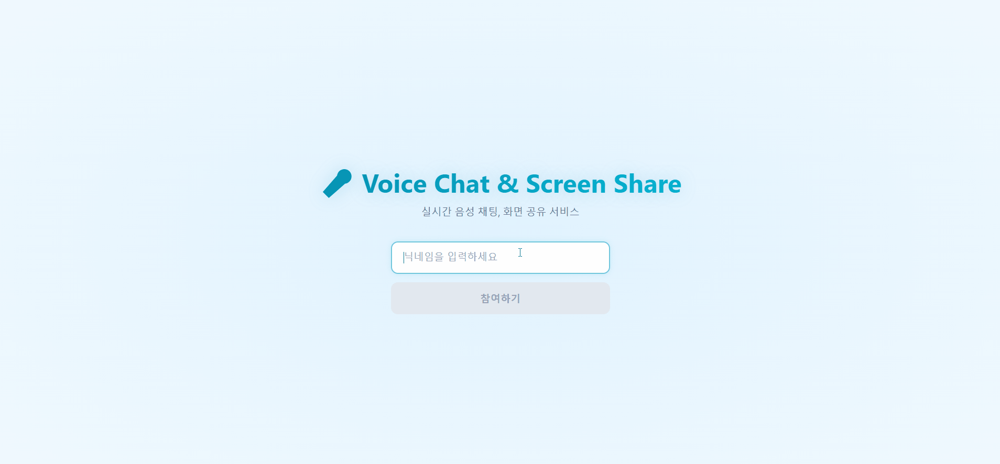
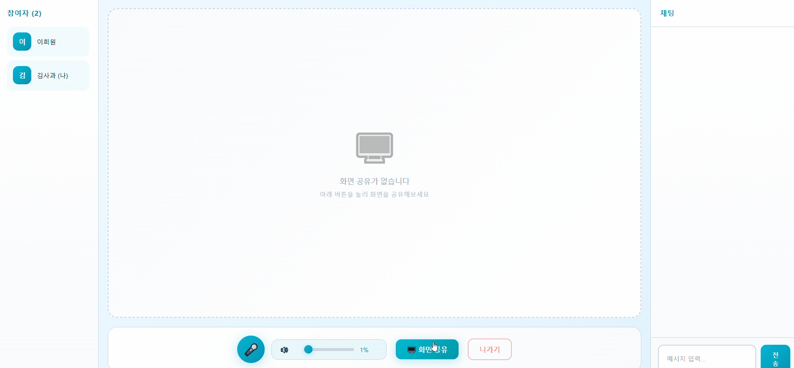

# 🎤 Voice Chat & Screen Share


실시간 음성 채팅과 화면 공유 기능을 제공하는 WebRTC 기반 웹 애플리케이션입니다.

## 📖 프로젝트 개요

이 프로젝트는 WebRTC와 Socket.io를 활용하여 실시간 음성 통신과 화면 공유 기능을 구현한 웹 애플리케이션입니다. 사용자는 방을 생성하거나 기존 방에 입장하여 다른 사용자들과 실시간으로 소통할 수 있습니다.

## 🎬 시연 영상

### 로비 및 방 목록



### 음성 채팅 및 화면 공유



## 📁 프로젝트 구조

## 🛠 기술 스택

### Frontend

- **React** 19.2.0
- **React Router DOM** 7.10.1
- **Socket.io Client** 4.8.1
- **Vite** 7.2.4
- **WebRTC API**

### Backend

- **Node.js**
- **Express** 4.18.2
- **Socket.io** 4.7.2
- **UUID** 9.0.0

## ✨ 주요 기능

### 🎙️ 실시간 음성 채팅

- WebRTC P2P 연결을 통한 고품질 음성 통신
- 음성 감지 및 시각적 표시
- 음소거 기능
- 볼륨 조절 (0-100%)

### 🖥️ 화면 공유

- 실시간 화면 공유 기능
- 다중 사용자 동시 화면 공유 지원
- 화면 전체화면 보기
- 공유 상태 실시간 표시

### 💬 텍스트 채팅

- 실시간 메시지 전송
- 타임스탬프 표시
- 발신자 구분

### 🚪 방 관리

- 방 생성 및 삭제
- 방 목록 실시간 업데이트
- 최대 5명까지 입장 가능
- 입장/퇴장 알림

## 🚀 설치 및 실행 방법

### 사전 요구사항

- Node.js 14.x 이상
- npm 또는 yarn

### 1️⃣ 저장소 클론

```bash
git clone <repository-url>
cd teamvoice
```

### 2️⃣ Backend 서버 실행

```bash
# 서버 디렉토리로 이동
cd server

# 의존성 설치
npm install

# 서버 실행
npm start
# 또는 개발 모드 (auto-reload)
npm run dev
```

서버가 `http://localhost:3001`에서 실행됩니다.

### 3️⃣ Frontend 클라이언트 실행

```bash
# 클라이언트 디렉토리로 이동 (새 터미널)
cd client

# 의존성 설치
npm install

# 개발 서버 실행
npm run dev
```

클라이언트가 `http://localhost:5173`에서 실행됩니다.

### 4️⃣ 접속

브라우저에서 `http://localhost:5173`로 접속하여 애플리케이션을 사용할 수 있습니다.

```
teamvoice/
├── client/                 # React 프론트엔드
│   ├── src/
│   │   ├── hooks/         # Custom Hooks
│   │   │   ├── useWebRTC.js        # 음성 채팅 로직
│   │   │   └── useScreenShare.js   # 화면 공유 로직
│   │   ├── pages/         # 페이지 컴포넌트
│   │   │   ├── NicknamePage.jsx
│   │   │   ├── LobbyPage.jsx
│   │   │   └── ChatRoom.jsx
│   │   ├── utils/
│   │   │   └── socket.js  # Socket.io 설정
│   │   ├── App.jsx
│   │   └── main.jsx
│   └── package.json
│
└── server/                # Node.js 백엔드
    ├── index.js           # 시그널링 서버
    └── package.json
```

## 🔧 트러블슈팅

### 마이크 권한 오류

**문제:** "마이크 접근 권한이 필요합니다" 오류 발생

**해결방법:**

- 브라우저 설정에서 마이크 권한 허용
- HTTPS 환경에서 실행 (로컬은 localhost 가능)
- 브라우저 주소창의 카메라/마이크 아이콘 클릭 후 권한 허용

### 화면 공유가 안 됨

**문제:** 화면 공유 버튼 클릭 시 아무 반응 없음

**해결방법:**

- 브라우저가 화면 공유를 지원하는지 확인 (Chrome, Edge, Firefox 권장)
- 시스템 설정에서 화면 녹화 권한 허용 (macOS의 경우)
- 페이지 새로고침 후 재시도

### 음성이 들리지 않음

**문제:** 연결은 되었지만 상대방 음성이 들리지 않음

**해결방법:**

- 볼륨이 0으로 설정되어 있는지 확인
- 상대방이 음소거 상태인지 확인
- 브라우저 콘솔에서 WebRTC 연결 상태 확인
- 페이지 새로고침 후 다시 방 입장

### Socket 연결 오류

**문제:** "서버에 연결할 수 없습니다" 오류

**해결방법:**

- 백엔드 서버가 실행 중인지 확인 (`http://localhost:3001`)
- `client/src/utils/socket.js`의 서버 URL 확인
- 방화벽 설정 확인
- CORS 설정 확인

### 방이 가득 찬 경우

**문제:** "방이 가득 찼습니다" 메시지

**해결방법:**

- 현재 방 최대 인원은 5명으로 설정되어 있습니다
- `server/index.js`의 `MAX_USERS_PER_ROOM` 값을 수정하여 인원 조정 가능
- 다른 방을 생성하거나 기존 방에서 인원이 나갈 때까지 대기

### 브라우저 호환성

- Chrome, Edge, Firefox 최신 버전 권장
- Safari는 일부 기능 제한이 있을 수 있습니다

### 보안

- 프로덕션 환경에서는 HTTPS 필수
- CORS 설정 검토 필요
